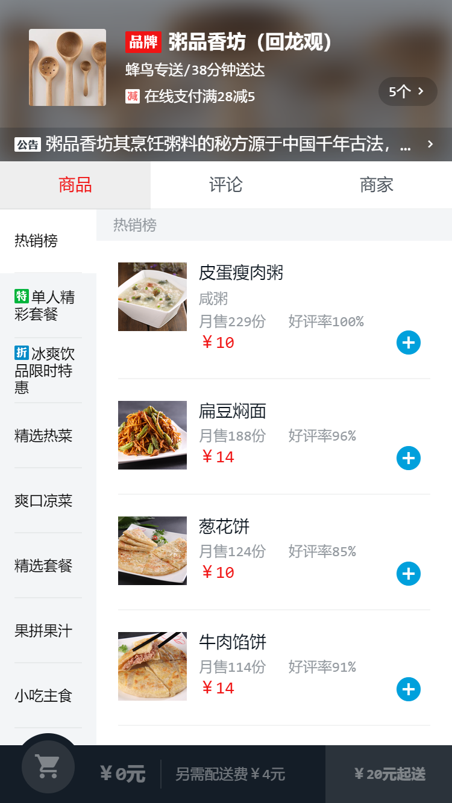
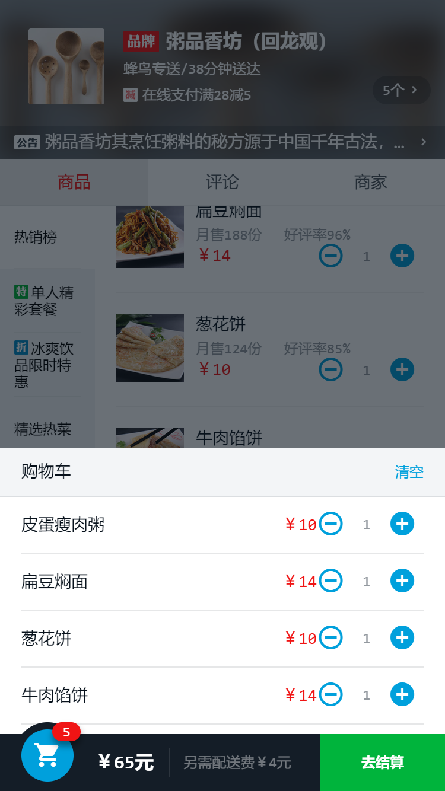
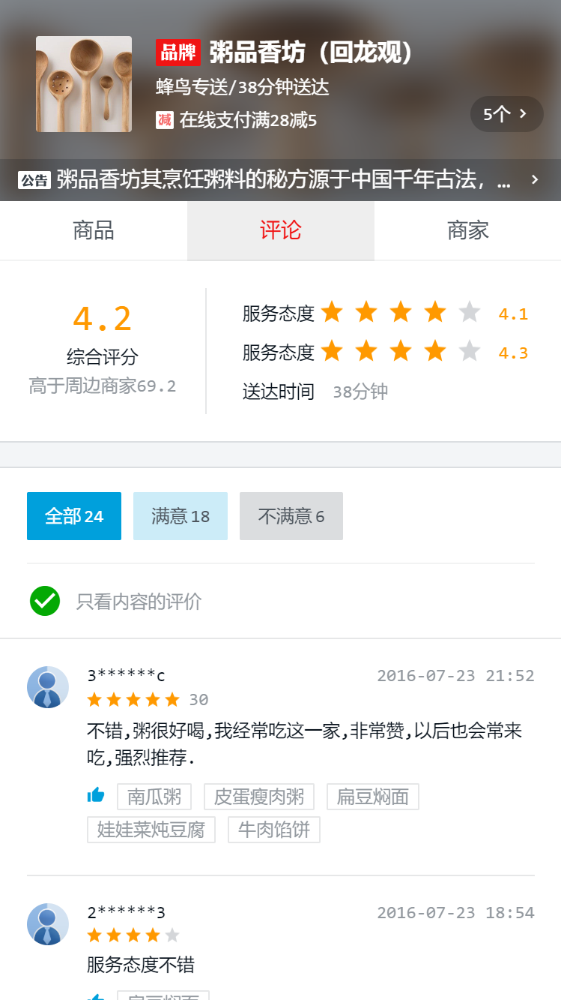
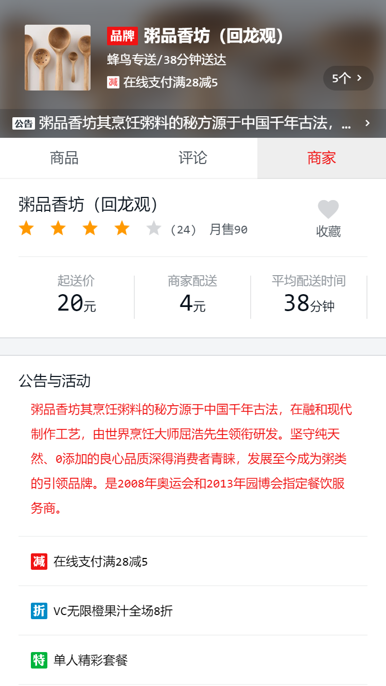

# my-vue
使用VUE仿外卖APP


## 效果图





```$xslt
# 克隆git仓库
git clone git@github.com:zxcvb2850/my_music.git

# 安装所需的包
npm install & yarn install

# 运行vue的项目 默认监听端口localhost:8080
npm run dev & yarn dev

# 打包vue项目
npm run build & yarn build
```

**由于mock了网络请求，所以打包之后的文件需要在web服务下运行**

查看我已经完成的页面 http://www.qhyking.com/takeaway 使用手机调试模式效果更佳
